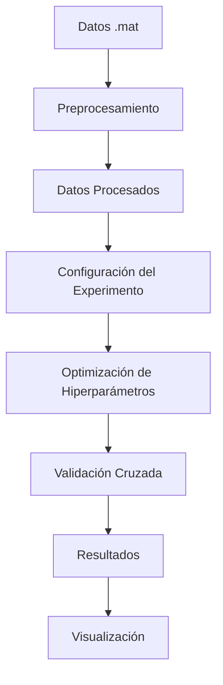

# IBioML

<div align="center">
  
  
  
</div>

**IBioML** es un toolkit de Machine Learning especializado para experimentos de neurodecodificación desarrollado en el IBioBA (Instituto de Investigación en Biomedicina de Buenos Aires).

## ✨ Características Principales

- 🧠 **Modelos especializados** para datos neuronales (MLP, RNN, LSTM, GRU)
- 📊 **Preprocesamiento automático** de archivos `.mat` de MATLAB
- 🔍 **Optimización de hiperparámetros** con Optuna
- 📈 **Visualización avanzada** de resultados y métricas
- 🔄 **Validación cruzada anidada** para evaluación robusta
- 📁 **Gestión inteligente** de experimentos y resultados

## 🚀 Inicio Rápido

### Instalación

```bash
pip install ibioml
```

### Uso Básico

```python
from ibioml.preprocessing import preprocess_data
from ibioml.models import MLPModel
from ibioml.tuner import run_study

# 1. Preprocesar datos
preprocess_data(
    file_path='datasets/mi_experimento.mat',
    file_name_to_save='data/experimento_procesado',
    bins_before=5,
    bins_after=5,
    bins_current=1,
    threshDPrime=2.5,
    firingMinimo=1000
)

# 2. Configurar experimento
mlp_config = {
    "model_class": MLPModel,
    "output_size": 1,
    "device": "cuda",
    "num_epochs": 200,
    "batch_size": 32,
    # Hiperparámetros a optimizar
    "hidden_size": (int, 128, 512, 64),  # (tipo, min, max, step)
    "lr": (float, 1e-5, 1e-2, True),     # (tipo, min, max, log_scale)
}

# 3. Ejecutar experimento
run_study(
    X, y, T,
    model_space=mlp_config,
    num_trials=50,
    outer_folds=5,
    save_path="results/mi_experimento"
)
```

## 📖 Documentación

- **[Guía de Instalación](installation.md)** - Configuración del entorno
- **[Preprocesamiento](preprocessing.md)** - Transformación de datos
- **[Experimentos](experiments.md)** - Configuración y ejecución
- **[Visualización](visualization.md)** - Análisis de resultados
- **[API Reference](api/models.md)** - Documentación completa de la API

## 🔬 Tipos de Experimentos Soportados

### Modelos Disponibles

| Modelo | Descripción | Uso Recomendado |
|--------|-------------|-----------------|
| **MLP** | Perceptrón multicapa | Datos sin estructura temporal |
| **RNN** | Red neuronal recurrente | Secuencias temporales básicas |
| **LSTM** | Long Short-Term Memory | Secuencias con dependencias largas |
| **GRU** | Gated Recurrent Unit | Alternativa eficiente a LSTM |

### Configuraciones de Datos

IBioML genera automáticamente múltiples variantes de tus datos:

=== "Con Contexto"
    - `withCtxt_onlyPosition` - Solo información de posición
    - `withCtxt_onlyVelocity` - Solo información de velocidad  
    - `withCtxt_bothTargets` - Posición y velocidad

=== "Sin Contexto"
    - `onlyPosition` - Posición sin contexto
    - `onlyVelocity` - Velocidad sin contexto
    - `bothTargets` - Ambos targets sin contexto

Cada configuración está disponible en formato `flat` (para modelos no recurrentes) y formato temporal (para modelos recurrentes).

## 🏗️ Arquitectura



## 🤝 Contribuir

¡Las contribuciones son bienvenidas! Ve la [guía de contribución](contributing.md) para más detalles.

## 📄 Licencia

Este proyecto está bajo la Licencia MIT. Ve el archivo [LICENSE](https://github.com/mariburginlab-labPrograms/IBioML/blob/main/LICENSE) para más detalles.

## 📧 Contacto

- **Email:** [jiponce@ibioba-mpsp-conicet.gov.ar](mailto:jiponce@ibioba-mpsp-conicet.gov.ar)
- **GitHub:** [mariburginlab-labPrograms/IBioML](https://github.com/mariburginlab-labPrograms/IBioML)

---

<div align="center">
  Desarrollado con ❤️ en el IBioBA
</div>
