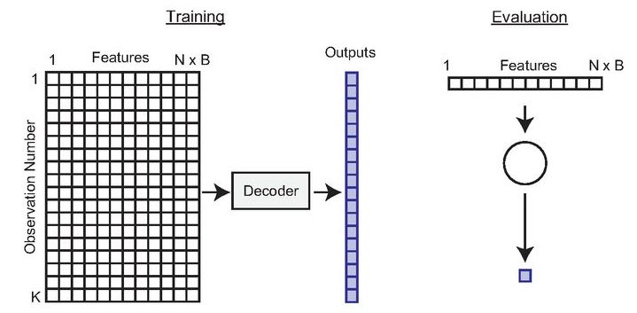

# Preprocesamiento de Datos

IBioML incluye un sistema robusto de preprocesamiento específicamente diseñado para transformar datos neuronales en formato `.mat` de MATLAB en estructuras optimizadas para machine learning.

## 🎯 Visión General

El preprocesamiento en IBioML realiza las siguientes operaciones:

1. **Carga de datos** desde archivos `.mat`
2. **Incorporación de contexto** (información de recompensa)
3. **Creación de ventanas temporales** con historia de spikes
4. **Filtrado de calidad** (rendimiento, duración de trials)
5. **Limpieza neuronal** (eliminación de neuronas con baja actividad)
6. **Generación de múltiples formatos** de datos

## 📊 Estructura de Datos de Entrada

### Formato del Archivo .mat

Tu archivo `.mat` debe contener las siguientes variables:

| Variable | Dimensiones | Descripción |
|----------|-------------|-------------|
| `neuronActivity` | (time_bins, neurons) | Actividad neuronal binaria |
| `position` | (time_bins, 1) | Posición del sujeto |
| `velocity` | (time_bins, 1) | Velocidad del sujeto |
| `rewCtxt` | (time_bins, 1) | Contexto de recompensa (0/1) |
| `trialFinalBin` | (trials, 1) | Último bin de cada trial |
| `dPrime` | (trials, 1) | Medida de rendimiento por trial |
| `trialDurationInBins` | (trials, 1) | Duración de cada trial |

## 🔧 Configuración de Parámetros

### Parámetros Principales

```python
from ibioml.preprocessing import preprocess_data

preprocess_data(
    file_path='datasets/mi_experimento.mat',
    file_name_to_save='data/experimento_procesado',
    bins_before=5,      # Ventana temporal hacia atrás
    bins_after=5,       # Ventana temporal hacia adelante  
    bins_current=1,     # Bins del momento actual
    threshDPrime=2.5,   # Umbral de rendimiento
    firingMinimo=1000   # Spikes mínimos por neurona
)
```

### Descripción de Parámetros

#### `bins_before` y `bins_after`
Define la ventana temporal de contexto:

```python
# Ejemplo con bins_before=3, bins_after=2, bins_current=1
# Para el bin t, se incluyen:
# [t-3, t-2, t-1, t, t+1, t+2] -> ventana de 6 bins total
```

!!! tip "Recomendaciones"
    - **bins_before=5, bins_after=5**: Para capturar contexto temporal amplio
    - **bins_before=3, bins_after=3**: Para análisis más rápidos
    - **bins_before=0, bins_after=0**: Solo información instantánea

#### `threshDPrime`
Umbral de discriminabilidad para filtrar trials de baja calidad:

- **2.0**: Criterio permisivo (incluye más datos)
- **2.5**: Criterio balanceado (recomendado)
- **3.0**: Criterio estricto (solo trials de alta calidad)

#### `firingMinimo`
Número mínimo de spikes que debe tener una neurona para ser incluida:

- **500**: Para datasets pequeños
- **1000**: Valor estándar recomendado
- **2000**: Para análisis que requieren alta actividad

## 📁 Organización de Archivos de Salida

### Estructura Recomendada

```
data/
├── bins200ms/              # Resolución temporal
│   ├── 5_5_1/             # bins_before_after_current
│   │   ├── 2_5/           # threshold (2.5 -> "2_5")
│   │   │   ├── experimento_withCtxt_onlyPosition.pickle
│   │   │   ├── experimento_withCtxt_onlyPosition_flat.pickle
│   │   │   ├── experimento_withCtxt_onlyVelocity.pickle
│   │   │   ├── experimento_withCtxt_onlyVelocity_flat.pickle
│   │   │   ├── experimento_withCtxt_bothTargets.pickle
│   │   │   ├── experimento_withCtxt_bothTargets_flat.pickle
│   │   │   ├── experimento_onlyPosition.pickle
│   │   │   ├── experimento_onlyPosition_flat.pickle
│   │   │   ├── experimento_onlyVelocity.pickle
│   │   │   ├── experimento_onlyVelocity_flat.pickle
│   │   │   ├── experimento_bothTargets.pickle
│   │   │   └── experimento_bothTargets_flat.pickle
│   │   └── 3_0/           # Otra configuración de threshold
│   └── 3_3_1/             # Otra configuración temporal
└── bins100ms/              # Otra resolución temporal
```

### Ejemplo de Uso con Organización

```python
preprocess_data(
    file_path='datasets/sujeto_S19.mat',
    file_name_to_save='data/bins200ms/5_5_1/2_5/S19_preprocessed',
    bins_before=5,
    bins_after=5,
    bins_current=1,
    threshDPrime=2.5,
    firingMinimo=1000
)
```

## 📦 Archivos Generados

### Variantes de Datos

Cada ejecución de `preprocess_data` genera **12 archivos** organizados en dos grupos principales:

=== "Con Contexto (`withCtxt`)"
    Incluye información de contexto de recompensa:
    
    - `_withCtxt_onlyPosition.pickle` / `_withCtxt_onlyPosition_flat.pickle`
    - `_withCtxt_onlyVelocity.pickle` / `_withCtxt_onlyVelocity_flat.pickle`
    - `_withCtxt_bothTargets.pickle` / `_withCtxt_bothTargets_flat.pickle`

=== "Sin Contexto"
    Solo información neuronal:
    
    - `_onlyPosition.pickle` / `_onlyPosition_flat.pickle`
    - `_onlyVelocity.pickle` / `_onlyVelocity_flat.pickle`
    - `_bothTargets.pickle` / `_bothTargets_flat.pickle`

### Estructura de Archivos

Cada archivo `.pickle` contiene una tupla:

```python
(X, y, trial_markers)
```

Donde:
- **X**: Datos de entrada (actividad neuronal)
- **y**: Variables objetivo (posición/velocidad)
- **trial_markers**: Identificadores de trial para cada muestra

## 🔍 Formatos de Datos

### Datos No Aplanados (para RNNs)

```python
# Estructura: (samples, time_bins, features)
X.shape = (n_samples, bins_before + bins_current + bins_after, n_neurons)
```


**Uso:** Modelos recurrentes (RNN, LSTM, GRU)

### Datos Aplanados (para MLPs)

```python
# Estructura: (samples, features_flattened)
X_flat.shape = (n_samples, (bins_before + bins_current + bins_after) * n_neurons)
```



**Uso:** Modelos no recurrentes (MLP, SVM, etc.)

## 🔧 Funciones de Utilidad

### Visualización de Calidad de Datos

```python
from ibioml.preprocessing import plot_trial_duration, plot_low_performance

# Cargar datos para análisis
mat_contents = io.loadmat('datasets/mi_experimento.mat')

# Visualizar duración de trials
plot_trial_duration(mat_contents['trialDurationInBins'])

# Visualizar rendimiento por trial
plot_low_performance(mat_contents['dPrime'])
```

### Verificación de Archivos Generados

```python
import pickle

# Cargar archivo para verificar
with open('data/experimento_withCtxt_flat.pickle', 'rb') as f:
    X, y, trial_markers = pickle.load(f)

print(f"Forma de X: {X.shape}")
print(f"Forma de y: {y.shape}")
print(f"Número de trials: {len(np.unique(trial_markers))}")
print(f"Samples por trial (promedio): {len(trial_markers) / len(np.unique(trial_markers)):.1f}")
```

## ⚡ Optimización de Rendimiento

### Para Datasets Grandes

```python
# Reducir memoria usando parámetros más restrictivos
preprocess_data(
    file_path='datasets/dataset_grande.mat',
    file_name_to_save='data/dataset_optimizado',
    bins_before=3,          # Ventana más pequeña
    bins_after=3,
    bins_current=1,
    threshDPrime=3.0,       # Criterio más estricto
    firingMinimo=2000       # Neuronas más activas
)
```

### Procesamiento en Lotes

```python
import os

# Procesar múltiples archivos
datasets = ['S19.mat', 'S20.mat', 'S21.mat']
base_config = {
    'bins_before': 5,
    'bins_after': 5,
    'bins_current': 1,
    'threshDPrime': 2.5,
    'firingMinimo': 1000
}

for dataset in datasets:
    subject_id = dataset.replace('.mat', '')
    preprocess_data(
        file_path=f'datasets/{dataset}',
        file_name_to_save=f'data/bins200ms/5_5_1/2_5/{subject_id}_preprocessed',
        **base_config
    )
    print(f"✅ Procesado: {subject_id}")
```

## 🚨 Solución de Problemas

### Errores Comunes

!!! warning "KeyError: 'neuronActivity'"
    Verifica que tu archivo `.mat` contenga todas las variables requeridas.

!!! warning "MemoryError durante el preprocesamiento"
    - Reduce `bins_before` y `bins_after`
    - Aumenta `firingMinimo` para filtrar más neuronas
    - Procesa en lotes más pequeños

!!! warning "Archivos vacíos después del filtrado"
    - Reduce `threshDPrime`
    - Verifica la calidad de tus datos de entrada
    - Ajusta `firingMinimo` a un valor menor

### Verificación de Calidad

```python
def verificar_preprocesamiento(archivo_pickle):
    with open(archivo_pickle, 'rb') as f:
        X, y, T = pickle.load(f)
    
    print(f"📊 Resumen de {archivo_pickle}:")
    print(f"   Muestras: {X.shape[0]:,}")
    print(f"   Features: {X.shape[1] if len(X.shape)==2 else X.shape[1]*X.shape[2]:,}")
    print(f"   Targets: {y.shape[1] if len(y.shape)>1 else 1}")
    print(f"   Trials únicos: {len(np.unique(T))}")
    
    # Verificar valores faltantes
    if np.any(np.isnan(X)):
        print("   ⚠️  Advertencia: Valores NaN en X")
    if np.any(np.isnan(y)):
        print("   ⚠️  Advertencia: Valores NaN en y")
    
    print("   ✅ Archivo válido")

# Verificar todos los archivos generados
archivos = [
    'data/experimento_withCtxt_flat.pickle',
    'data/experimento_onlyPosition_flat.pickle'
]

for archivo in archivos:
    verificar_preprocesamiento(archivo)
```

## 📈 Próximos Pasos

Una vez completado el preprocesamiento:

1. **[Configurar experimentos →](experiments.md)** Aprende a usar los datos procesados
2. **[API Reference →](api/preprocessing.md)** Documentación detallada de funciones
3. **[Ejemplos →](examples/basic_tutorial.md)** Tutoriales paso a paso
